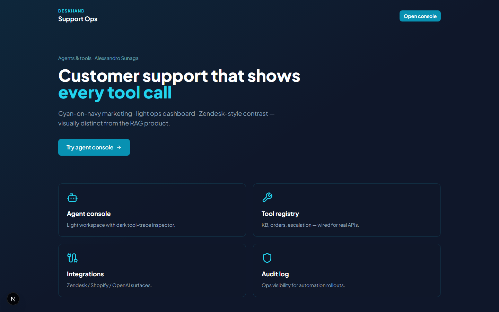
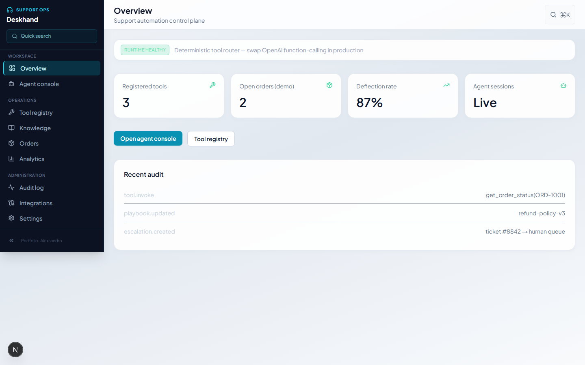
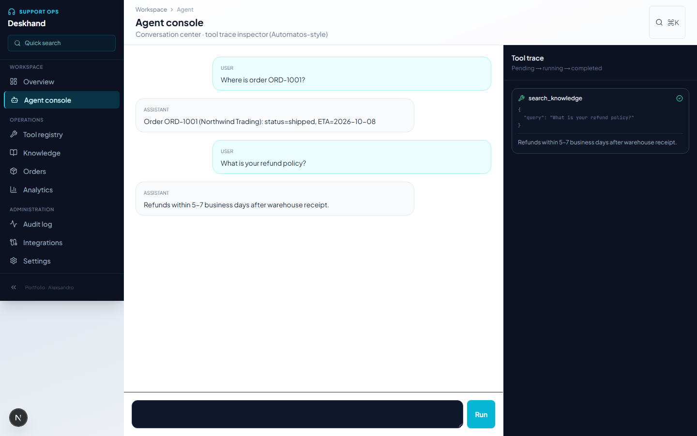
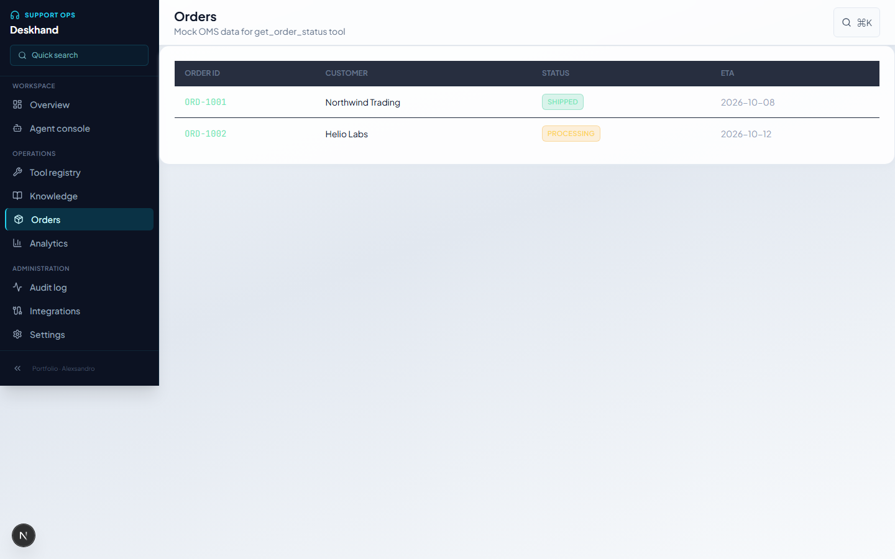

# Deskhand

## Demo

[](docs/demo/demo.mp4)

The video walks through the landing page, ops dashboard and agent console, running `ORD-1001`, a refund-policy question and an escalation request, with the tool trace shown for each. [Watch the MP4](docs/demo/demo.mp4).

## Screenshots







**AI agents · tool calling · support automation**


**Next.js 15** product console + **FastAPI** agent API with tool router (deterministic rules; ready to swap in **OpenAI / Anthropic** function-calling).

**GitHub topics:** `ai-agents`, `tool-calling`, `llm`, `nextjs`, `customer-support`, `openai`

## Run

**API (FastAPI, port 8001)**

```bash
cd backend
python -m venv .venv && .venv\Scripts\activate
pip install -r requirements.txt
uvicorn app.main:app --reload --port 8001
```

**Console (Next.js, port 3001)**

```bash
npm install
set AGENT_API_URL=http://127.0.0.1:8001
npm run dev
```

- Marketing: http://localhost:3001  
- Console: http://localhost:3001/dashboard  
- Agent: http://localhost:3001/dashboard/agent  

Try: `ORD-1001`, refund policy, password reset, “escalate to human”.

## Console routes

Overview · Agent console (chat + tool trace) · Tool registry · Knowledge · Orders · Analytics · Audit · Integrations · Settings

⌘K command palette · collapsible sidebar · mobile nav

## Summary

Support agent with tool traces, KB + order tools, and ops dashboard (Next.js + FastAPI). LLM-backed router can be enabled per deployment.

## Tests

```bash
cd backend
pip install -r requirements.txt -r requirements-dev.txt
python -m pytest -q
```

## Author

**Alexsandro Sunaga**

## License

MIT License — Copyright (c) 2026 Alexsandro Sunaga. See the license section in this repository for full terms.
